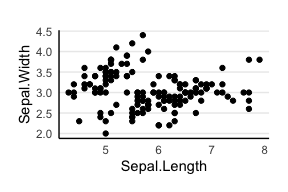
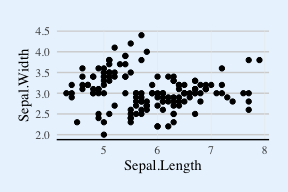
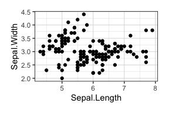
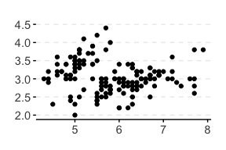

<!-- README.md is generated from README.Rmd. Please edit that file -->

# ggthemepark

<!-- badges: start -->
<!-- badges: end -->

The ggthemepark package provides many new themes for ggplot2.

## Installation

You can install löatest version of ggthemepark from
[GitHub](https://github.com/NickGlaettli/ggthemepark) with:

``` r
# install.packages("devtools")
devtools::install_github("NickGlaettli/ggthemepark")
```

## Usage

The themes are used as any `ggplot` theme. The themes `simple` and
`lightblue` provide the possibility to add a line along th y-axis by
calling `yline = TRUE`.

``` r
#Theme simple
ggplot(iris, aes(Sepal.Length, Sepal.Width))+
  geom_point()+
  theme_simple(yline = TRUE)
```



``` r
#Theme lightblue
ggplot(iris, aes(Sepal.Length, Sepal.Width))+
  geom_point()+
  theme_lightblue()
```



``` r
#Theme bw2
ggplot(iris, aes(Sepal.Length, Sepal.Width))+
  geom_point()+
  theme_bw2()
```



``` r
#Theme owid
ggplot(iris, aes(Sepal.Length, Sepal.Width))+
  geom_point()+
  theme_owid()
```


